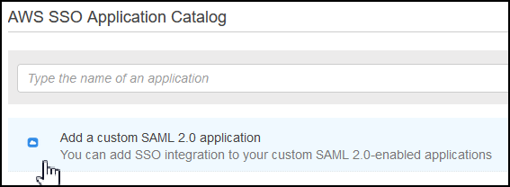
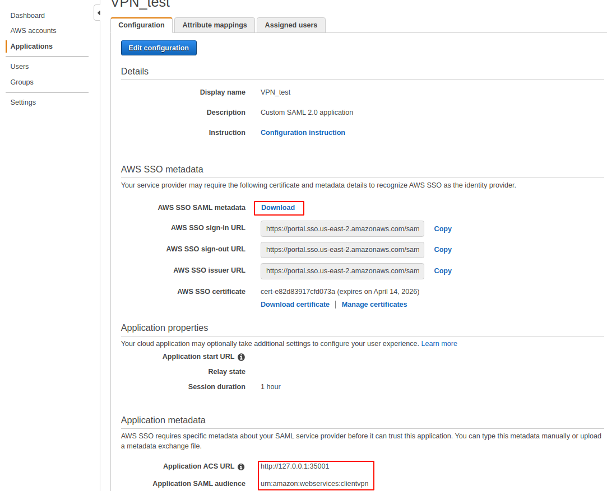
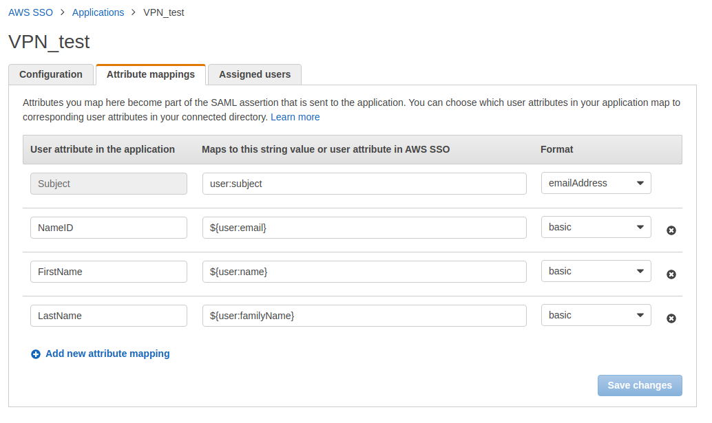
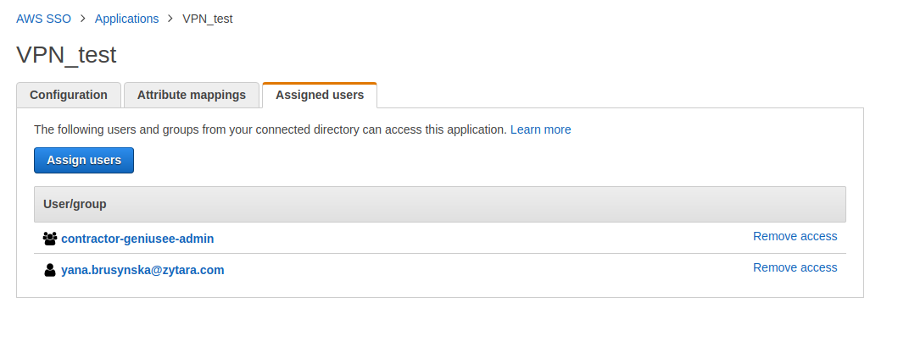
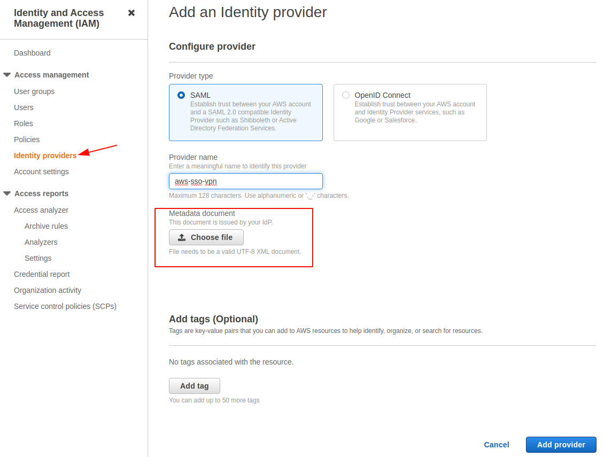
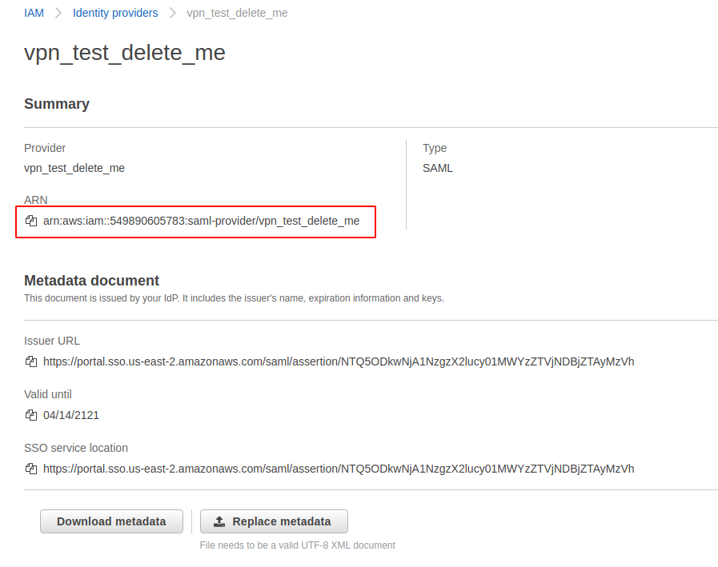

# AWS Client VPN Terraform module

Terraform module which creates Client VPN Endpoint resources on AWS.

These type of resources are supported:
- ACM Certificate
- EC2 Client VPN Endpoint
- EC2 Client VPN Network association
- CloudWatch Log Group
- CloudWatch Log Stream

### Attention please

Please note that the current module only creates an AWS client VPN. You should configure the AWS SSO application yourself by simply following the instructions in this Readme file.

### Deploy

You may need to add execution permission :
```sh
chmod +x .terraform/modules/client_vpn/scripts/*
```

### Using federated authentification (best security) :
- AWS VPN Client download link : https://aws.amazon.com/vpn/client-vpn-download/
- You can find the generated Client VPN configuration into your terraform folder.
- Each user have a login/password to authenticate.

```hcl
module "client_vpn" {
  source                = "../client_vpn"
  region                = "us-east-2"
  cloudwatch_log_group  = "vpn-2"
  cloudwatch_log_stream = "vpn-2"
  env                   = "production"
  cert_issuer           = "phoenix-2.internal"
  cert_server_name      = "phoenix-2"
  aws_tenant_name       = "aws"
  subnet_id             = "subnet-da1e6496"
  client_cidr_block     = "10.250.0.0/16"
  
  authorization_rules = [
    {
      name                 = "contractor-geniusee-admin"
      access_group_id      = "9a672b3238-f2091dac-ac6f-1234-1234-7f78af1bdd85"
      description          = "admin access"
      target_network_cidr  = "172.31.0.0/16"
    },
    {
      name                 = "contractor-geniusee-qa"
      access_group_id      = "9a672b3238-9a8d67e8-e4c0-1234-1234-9d06d608226e"
      description          = "qa access"
      target_network_cidr  = "172.31.0.0/16"
    }
  ]
  
  target_cidr_block     = "172.31.0.0/16"
  vpn_name              = "VPN-2"
  client_auth           = "federated-authentication"
  saml_provider_arn     = "arn:aws:iam::123456789123:saml-provider/vpn_test_delete_me"
}
```

## Configuration of AWS SSO app and IAM identity provider

1. Go to your "AWS SSO" console services

2. Add a new SAML application:



3. Configure the application:
- Download the metadata file for the next section
- Configure Application metadata:

```
URL: http://127.0.0.1:35001
URN: urn:amazon:webservices:clientvpn
```



4. Add attribute mappings:



5. Assigned users: Add the VPN group/users



6. From the IAM Console add a new identity provider and select the metadata file we created previously:



7. Save the ARN value



8. Use this ARN in a terraform module at `saml_provider_arn`